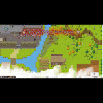

# Scrypts of Betrayal


## Description

This is a javascript fueled web based video game. The user is able to login, and play a basic 2d pixel art top-down video game. 

## Table of Contents

- [Visual Example and Deployed Application](#visual-example)
- [Installation & Usage](#installation)
- [Our Inspiration](#inspiration)
- [Contributors](#contributors)
- [Breakdown of Tasks](#breakdown)
- [Future Development](#future-development)
- [Technologies Used](#technologies)
- [Resources](#resources)

## Visual Example 



Live URL: https://scrypts-of-betrayal.herokuapp.com/

## Installation

1. Fork the repo
2. Clone the repo from your github
3. Install NPM packages
  ```npm install```
4. Create your local database with ```mysql -u root -p```. Type in your password and in the MYSQL CLI run ```source ./db/schema.sql```
5. Make sure to create a .env file using the .env.EXAMPLE as the boiler plate
6. ```npm run``` will start the server. Please visit localhost:3001 in order to view the webpage/game visually.

## Inspiration

As developers, Devin and Nathan have loved video games and the making of video games. Finding a platform that we were able to build a game with javascript/typescript was very exciting. Tifanny decided to join us in our endeavors, because she knew our webpages could use our help. Tifanny has also enjoyed playing a view hours of call of duty, and has since decided that our game is better. 

## Contributors
-[Tifanny Rivera](https://github.com/trivera777)
-[Devin Mosca](https://github.com/dmosca2021)
-[Nathan Flessner](https://github.com/SirNathanJF)

## Breakdown of Tasks

```
- Tifanny - Database Doctor, HTML/View expert, Bulma Queen, functional Javascript ninja. 
- Devin - Github Guru, Presentation Purveyor, Project Manager, API researcher
- Nathan - Node/Express master, Data Flow Doctor, Tiled map maker/video editor. Video editor is a very loose term here. 
That being said, the distribution of tasks and completion of them felt very even to us. We were happy to work together. 
```

## Future Development

```
More interaction with game environment
Inventory system - possibly with VueJS
Passport Authentication and login
Music/Sound Effects
Save game function
Quests - To complete the quests users will need to complete tasks related to JavaScript and coding as a whole.
Ex: In order to get an item from a chest you will need to finish a section of incomplete code in order to access the chests contents.
```

## Technologies


## 


